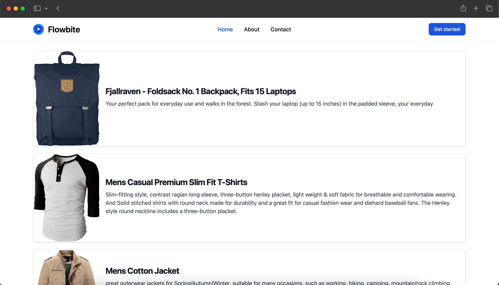
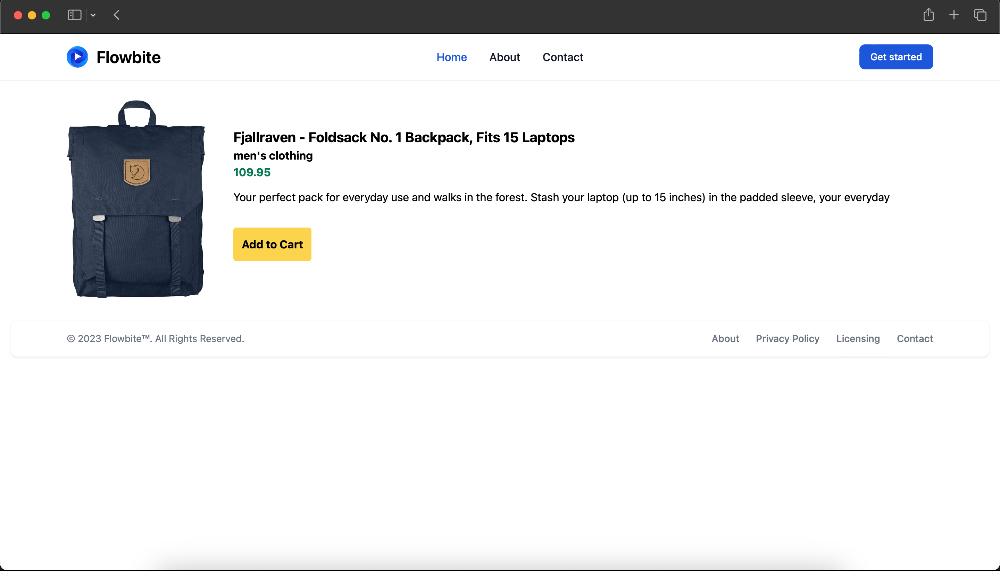

# Belajar Next.JS dari Awal untuk Pemula dalam 2 Jam

This is a [Next.js](https://nextjs.org/) project bootstrapped with [`create-next-app`](https://github.com/vercel/next.js/tree/canary/packages/create-next-app).

## Screenshots




## Getting Started

First, run the development server:

```bash
npm run install
# then
npm run dev
# or
yarn dev
# or
pnpm dev
```

Open [http://localhost:3000](http://localhost:3000) with your browser to see the result.

## Learn More

To learn more about Next.js, take a look our youtube video

- [Belajar Next.js dari awal](https://youtu.be/jJUQzsNgoT4)
